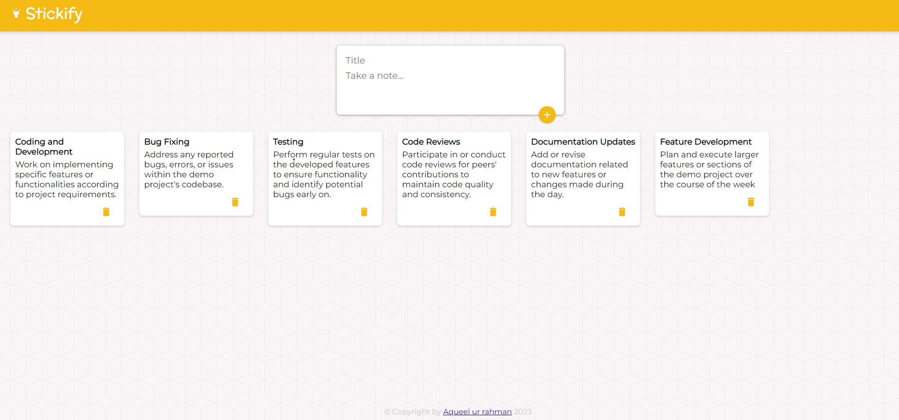

# Stickify
 
Stickify: Your note-taking ally. Like Google Keep, it's effortless. Create, organize, and manage digital sticky notes hassle-free. User-friendly interface, intuitive features. Easily handle thoughts, tasks, and reminders neatly.

## Technologies Used

The technologies and tools were used to develop this project are 

- **Front-end:** HTML5, CSS3, and JavaScript form the foundation, while React.js powers the dynamic components and user interface. The use of `.jsx` files enables seamless integration of HTML within JavaScript.
- **Backend:** Node.js with Express.js handles the server-side logic, ensuring smooth operations and handling requests efficiently.
- **Database:** MongoDB serves as the reliable database, securely storing and managing note details.

## Getting Started

Follow these steps to get the project up and running on your local machine for development and testing:

### Prerequisites

Make sure you have the following requirements met:

- Latest version of npm and Node.js installed.
- Windows/Linux/Mac machine.

### Installation

1. Clone the repository

   ```bash
   git clone https://github.com/username/projectname.git
   ```

2. Move into the project directory

   ```bash
   cd projectname
   ```

3. Install the dependencies

   ```bash
   npm install
   ```

4. Configure server

    - Set up your MongoDB account and create Collections in the Cluster section.
    - Obtain the unique 'USER' and 'PASS' for that cluster and insert them into `index.js` on lines 10 and 11.
    - In `App.jsx`, on line 9, remove "https://keeper-api-azna.onrender.com" and replace it with "http://localhost:5000".

5. Start the Backend Server

    ```bash
    nodemon index.js
    ```
    This will launch your server at `http://localhost:5000`.

6. Run the below command to start the web server.

   ```bash
   npm start
   ```

   Open link that shows up in the terminal, with your browser to see the result.

### Usage Guide

- **Getting Started:**
    Click on the "Take a note..." placeholder to initiate.
- **Adding a Note:**
    Upon entering content in the note and clicking on **"+"**, a new note tile is created along with a delete button.
- **Deleting a Note:**
    Remove a note by clicking on the bin button associated with it.

## Screenshots



## Contributing

Contributions to Stickify are welcome! To contribute, follow these steps:

1. Fork the repository.
2. Create a new branch for your feature or bug fix:

```bash
git checkout -b feature/your-feature-name
```

3. Make changes and commit them:

```bash
git commit -m "Add your commit message here"
```

4. Push your changes to your branch:

```bash
git push origin feature/your-feature-name
```

5. Create a pull request on the main repository.

Please follow the project's coding guidelines and maintain a clean commit history.

## License

This website is licensed under the MIT License. See the [LICENSE](LICENSE) file for details.

## Contact

If you have any questions or feedback, feel free to reach out to us at therahman14@gmail.com. We're excited to hear from you and make this project even better!